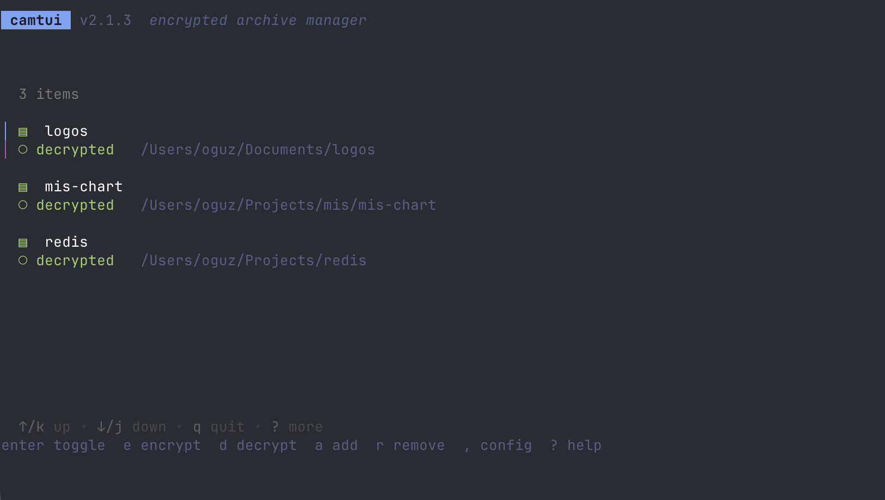
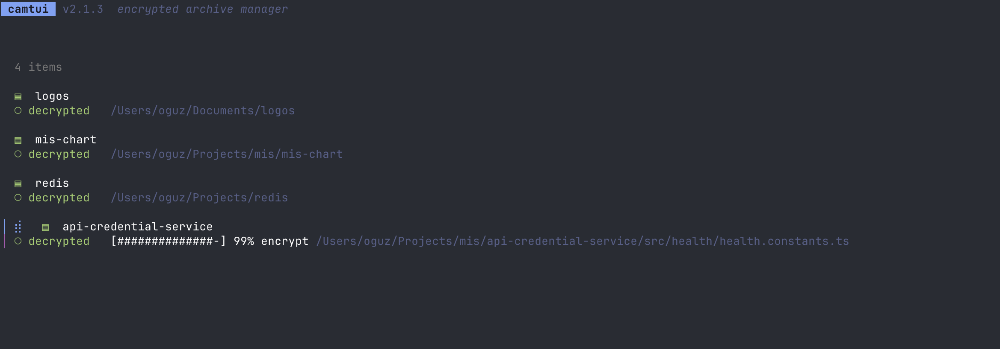
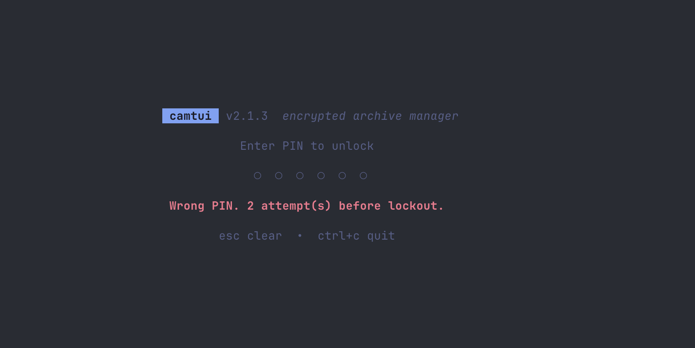
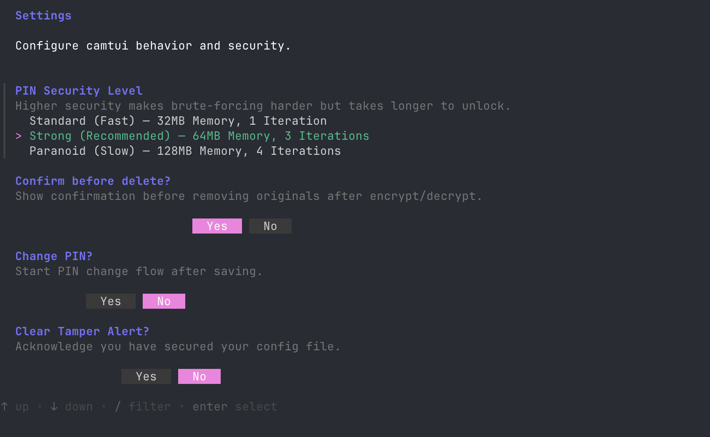

# 🛡️ camtui

### **The Fortified Terminal Archive Manager.**

*Secure. Tamper-Proof. Brute-Force Resistant.*

`camtui` is a professional-grade Terminal User Interface (TUI) engineered for high-stakes data privacy. It combines a streamlined workflow with a "Zero-Trust" security model, ensuring your archives remain impenetrable even if your hardware is compromised.

[](#security-protocol)
[](#brute-force-resistance)
[](#tamper-evident-architecture)
[](#versioning)

---

## ✨ Showcase

| Security Dashboard | Active Encryption |
| :---: | :---: |
|  |  |

| Secure PIN Entry | Advanced Settings |
| :---: | :---: |
|  |  |

---

## 🔒 The Security Protocol

### **1. Six-Digit Unified PIN**

Every operation—from vault entry to file decryption—is guarded by a mandatory **6-digit security PIN**. This protocol ensures a uniform security surface across all encryption and decryption methods, eliminating weak points in the user-access layer.

### **2. Brute-Force Proof (Argon2id)**

`camtui` utilizes **Argon2id**, the gold standard in memory-hard key derivation. By enforcing high memory and CPU costs during PIN validation, it effectively neutralizes hardware-accelerated brute-force attacks (ASICs/GPUs).

* **Standard:** Fast, daily protection.
* **Paranoid:** Maximum resource cost to defeat state-level extraction attempts.

### **3. Tamper-Evident Architecture**

The application employs an **Authenticated Encryption (AES-256-GCM)** model. Any attempt to modify your encrypted data or the underlying configuration files results in an immediate integrity failure. If a single bit is changed, `camtui` refuses to decrypt, protecting you from sophisticated "bit-flipping" attacks.

### **4. Backward Compatible & Future Proof**

Our metadata engine is designed with **Strict Backward Compatibility**. Archives encrypted today will remain accessible in future versions, ensuring your long-term data cold-storage strategy is never interrupted by software updates.

---

## 🚀 Key Features

* **🔐 Master Key Architecture:** Decoupled PIN management allows you to change your 6-digit access code without re-encrypting your entire library.
* **🖥️ Native OS Integration:** Zero-latency access to system-native file pickers (`Ctrl+F` / `Ctrl+D`) while maintaining the TUI's security context.
* **🔄 OTA Updates:** Secure, one-command binary updates (`u`) verified via GitHub Release signatures.
* **⚡ Zero Dependency Static Binary:** Compiled in Go for maximum portability with no external runtime requirements.
* **🧼 Memory Sanitization:** All cryptographic keys are zeroed out of RAM the microsecond the application closes.

---

## 📥 Deployment

`camtui` is delivered as a single, hardened static binary. You can install it instantly using our universal installers.

### macOS / Linux

```bash
curl -sSL https://raw.githubusercontent.com/oguzeray/camtui-public/main/install.sh | bash
```

### Windows (PowerShell)

```powershell
powershell -c "irm https://raw.githubusercontent.com/oguzeray/camtui-public/main/install.ps1 | iex"
```

> **Manual Install:** If you prefer to download the binary manually, visit the [Releases](https://github.com/oguzeray/camtui-public/releases) page.

---

## ⌨️ Tactical Shortcuts

| Key | Tactical Action |
| :--- | :--- |
| `a` | **Add** new assets to the vault |
| `e` | **Encrypt** with 6-digit PIN verification |
| `d` | **Decrypt** and restore to original state |
| `r` | **Remove** metadata reference |
| `u` | **Update** binary to latest secure version |
| `,` | **Configure** security hardening levels |
| `q` | **Quit** and purge memory keys |

---

## 📄 Licensing & Distribution

`camtui` is distributed as **Secure Freeware**. You are granted a license to use and distribute the compiled binaries. The underlying source code remains proprietary to ensure the integrity of the security implementation and prevent unauthorized "gray-market" forks.

---

<p align="center">
  <b>Elevate your terminal security to the next level.</b>
</p>
